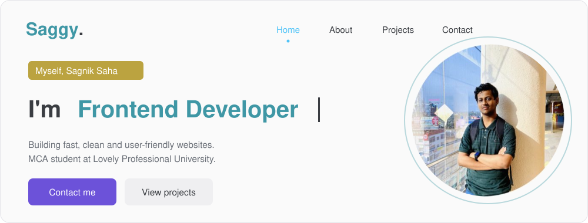
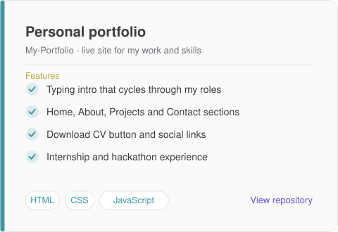
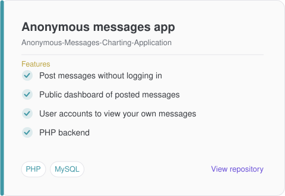
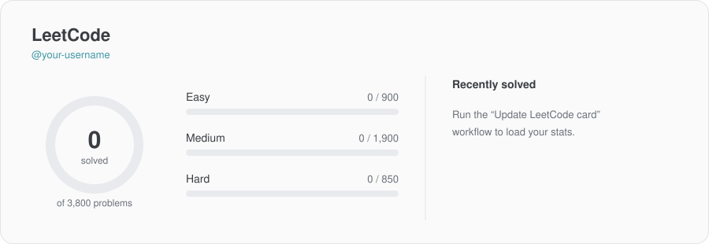

 

  

---

## About me

I'm an MCA student at **Lovely Professional University** who likes turning ideas into working web apps. I build interfaces with **HTML, CSS, JavaScript and React**, connect them to **PHP and MySQL** backends, and practice problem solving on LeetCode.

- Currently improving my skills in **React, Laravel and backend development**
- Interested in **software development and problem solving**
- Ask me about **HTML, CSS, JavaScript, PHP, MySQL and React**

---

## Featured projects

<table>
<tr>
<td width="50%" align="center">

</td>
<td width="50%" align="center">

</td>
</tr>
</table>

---

## LeetCode

---

## Tech stack

| | |
| :-- | :-- |
| **Frontend** |  |
| **Backend** |  |
| **Database** |  |
| **Languages** |  |
| **Tools** |  |

---

## Contribution activity

<picture>
  <source media="(prefers-color-scheme: dark)" srcset="https://raw.githubusercontent.com/sagnik81599/sagnik81599/output/github-snake-dark.svg" />
  
</picture>

---

Let's build something together. Say hello at **YOUR-EMAIL@example.com**

